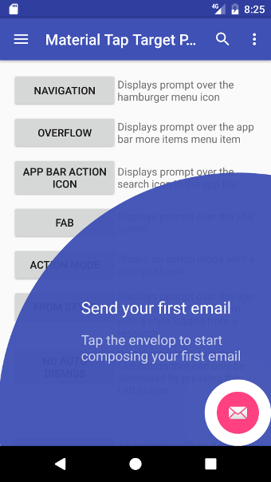
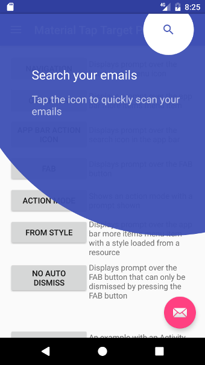
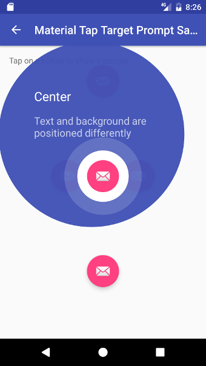
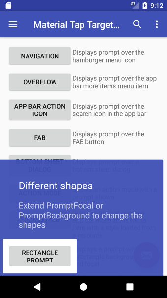

# Material Tap Target Prompt
[](https://travis-ci.org/sjwall/MaterialTapTargetPrompt)
[](https://codecov.io/gh/sjwall/MaterialTapTargetPrompt)
[](https://bintray.com/sjwall/maven/material-tap-target-prompt/_latestVersion)

A Tap Target implementation in Android based on Material Design Onboarding guidelines. For more information on tap targets check out the [guidelines][1].

 

 

# Sample App
The sample app in the repository is available on Google Play:

<a href='https://play.google.com/store/apps/details?id=uk.co.samuelwall.materialtaptargetprompt.sample&utm_source=global_co&utm_medium=prtnr&utm_content=Mar2515&utm_campaign=PartBadge&pcampaignid=MKT-Other-global-all-co-prtnr-py-PartBadge-Mar2515-1'></a>

# Gradle
To use the gradle dependency, add this to build.gradle:
```groovy
repositories {
    jcenter()
}

dependencies {
    implementation 'uk.co.samuelwall:material-tap-target-prompt:2.6.1'
}
```
Supports minSdkVersion 14

# Usage
Basic usage is shown below with more [examples](https://github.com/sjwall/MaterialTapTargetPrompt/tree/master/sample/src/main/java/uk/co/samuelwall/materialtaptargetprompt/sample) in the sample app:

```java
new MaterialTapTargetPrompt.Builder(MainActivity.this)
        .setTarget(findViewById(R.id.fab))
        .setPrimaryText("Send your first email")
        .setSecondaryText("Tap the envelop to start composing your first email")
        .setPromptStateChangeListener(new MaterialTapTargetPrompt.PromptStateChangeListener()
        {
            @Override
            public void onPromptStateChanged(MaterialTapTargetPrompt prompt, int state)
            {
                if (state == MaterialTapTargetPrompt.STATE_FOCAL_PRESSED)
                {
                    // User has pressed the prompt target
                }
            }
        })
        .show();
```

If a target is not set or both the primary and secondary text are `null` then `builder.show` and `builder.create` will return `null`.

## Different shapes

The default shape is a circle but any other shape can be rendered by extending the [PromptBackground](https://github.com/sjwall/MaterialTapTargetPrompt/blob/master/library/src/main/java/uk/co/samuelwall/materialtaptargetprompt/extras/PromptBackground.java) and [PromptFocal](https://github.com/sjwall/MaterialTapTargetPrompt/blob/master/library/src/main/java/uk/co/samuelwall/materialtaptargetprompt/extras/PromptFocal.java) classes.
A rectangle implementation is provided through the [RectanglePromptBackground](https://github.com/sjwall/MaterialTapTargetPrompt/blob/master/library/src/main/java/uk/co/samuelwall/materialtaptargetprompt/extras/backgrounds/RectanglePromptBackground.java) and [RectanglePromptFocal](https://github.com/sjwall/MaterialTapTargetPrompt/blob/master/library/src/main/java/uk/co/samuelwall/materialtaptargetprompt/extras/focals/RectanglePromptFocal.java) implementations.

```java
new MaterialTapTargetPrompt.Builder(this)
                .setTarget(view)
                .setPrimaryText("Different shapes")
                .setSecondaryText("Extend PromptFocal or PromptBackground to change the shapes")
                .setPromptBackground(new RectanglePromptBackground())
                .setPromptFocal(new RectanglePromptFocal())
                .show();
```



# License
    Copyright (C) 2016-2018 Samuel Wall

    Licensed under the Apache License, Version 2.0 (the "License");
    you may not use this file except in compliance with the License.
    You may obtain a copy of the License at

    http://www.apache.org/licenses/LICENSE-2.0

    Unless required by applicable law or agreed to in writing, software
    distributed under the License is distributed on an "AS IS" BASIS,
    WITHOUT WARRANTIES OR CONDITIONS OF ANY KIND, either express or implied.
    See the License for the specific language governing permissions and
    limitations under the License.


[1]: https://www.google.com/design/spec/growth-communications/feature-discovery.html#feature-discovery-design
