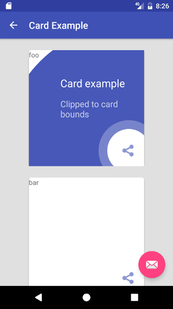

# DEPRECATED

Android is moving towards compose, for an alternative library in compose have a look at [intro-showcase-view](https://github.com/canopas/Intro-showcase-view).

Bug fix pull requests will be accepted for this library for the immediate future but there will be no active development or new features and it will eventually be archived.

Thank you to everyone who has contributed to the library over the years!

<h1 align="center">Material Tap Target Prompt</h1>

<p align="center">
    
    <br>
    <i>A Tap Target implementation in Android based on Material Design Onboarding guidelines. For more information on tap targets check out the <a href="https://material.io/design/communication/onboarding.html#quickstart-model">guidelines</a>.</i>
</p>

<p align="center">
  <a href="https://sjwall.github.io/MaterialTapTargetPrompt"><strong>sjwall.github.io/MaterialTapTargetPrompt</strong></a>
  <br>
</p>

<p align="center">
    <a href="https://sjwall.github.io/MaterialTapTargetPrompt/#quick-start">Quick start</a>
    ·
    <a href="https://sjwall.github.io/MaterialTapTargetPrompt/examples">Examples</a>
    ·
    <a href="https://github.com/sjwall/MaterialTapTargetPrompt/tree/master/sample/src/main/java/uk/co/samuelwall/materialtaptargetprompt/sample">Sample app</a>
    <br>
    <br>
</p>

<p align="center">
    <a href="http://unmaintained.tech/">
        
    </a>
    <a href="https://app.travis-ci.com/github/sjwall/MaterialTapTargetPrompt">
        
    </a>
    <a href="https://codecov.io/gh/sjwall/MaterialTapTargetPrompt">
        
    </a>
    <a href="https://codeclimate.com/github/sjwall/MaterialTapTargetPrompt/maintainability">
        
    </a>
    <a href="https://repo1.maven.org/maven2/uk/co/samuelwall/material-tap-target-prompt/">
        
    </a>
    <a href="https://sjwall.github.io/MaterialTapTargetPrompt/javadoc">
        
    </a>
    <a href="https://github.com/sjwall/MaterialTapTargetPrompt/blob/master/LICENSE">
        
    </a>
    <a href="http://makeapullrequest.com">
        
    </a>
</p>

<p align="center">
    
    
    
    
</p>

The sample app is available to download on the [Google Play Store][5]:
<a href='https://play.google.com/store/apps/details?id=uk.co.samuelwall.materialtaptargetprompt.sample&utm_source=global_co&utm_medium=prtnr&utm_content=Mar2515&utm_campaign=PartBadge&pcampaignid=MKT-Other-global-all-co-prtnr-py-PartBadge-Mar2515-1'></a>

# Quick start

## Gradle

Add the following to `build.gradle` using Maven Central:

```groovy
dependencies {
    implementation 'uk.co.samuelwall:material-tap-target-prompt:3.3.2'
}
```
Supports Android minSdkVersion 14

Version 2.15.0 works with Android Support Library

Also available from [GitHub packages](https://github.com/sjwall/MaterialTapTargetPrompt/packages/277676)

## Usage
Basic usage is shown below with more examples in the [sample app][2] and [documentation][3]:

```java
new MaterialTapTargetPrompt.Builder(MainActivity.this)
        .setTarget(R.id.fab)
        .setPrimaryText("Send your first email")
        .setSecondaryText("Tap the envelope to start composing your first email")
        .setPromptStateChangeListener(new MaterialTapTargetPrompt.PromptStateChangeListener()
        {
            @Override
            public void onPromptStateChanged(MaterialTapTargetPrompt prompt, int state)
            {
                if (state == MaterialTapTargetPrompt.STATE_FOCAL_PRESSED)
                {
                    // User has pressed the prompt target
                }
            }
        })
        .show();
```

### Note

If a target is not set or the target view could not be found or both the primary and secondary text are `null` then `builder.show` and `builder.create` will return `null`.

# Other shapes

The default shape is a circle but any other shape can be rendered by extending the [PromptBackground][6] and [PromptFocal][7] classes.
Custom shapes such as a rectangle can be set by calling `setPromptBackground` and/or `setPromptFocal`.
Documentation and examples are available [here][8].


# License
    Copyright (C) 2016-2021 Samuel Wall

    Licensed under the Apache License, Version 2.0 (the "License");
    you may not use this file except in compliance with the License.
    You may obtain a copy of the License at

    http://www.apache.org/licenses/LICENSE-2.0

    Unless required by applicable law or agreed to in writing, software
    distributed under the License is distributed on an "AS IS" BASIS,
    WITHOUT WARRANTIES OR CONDITIONS OF ANY KIND, either express or implied.
    See the License for the specific language governing permissions and
    limitations under the License.

[2]: https://github.com/sjwall/MaterialTapTargetPrompt/tree/master/sample/src/main/java/uk/co/samuelwall/materialtaptargetprompt/sample
[3]: https://sjwall.github.io/MaterialTapTargetPrompt/examples
[5]: https://play.google.com/store/apps/details?id=uk.co.samuelwall.materialtaptargetprompt.sample&utm_source=global_co&utm_medium=prtnr&utm_content=Mar2515&utm_campaign=PartBadge&pcampaignid=MKT-Other-global-all-co-prtnr-py-PartBadge-Mar2515-1
[6]: https://github.com/sjwall/MaterialTapTargetPrompt/blob/master/library/src/main/java/uk/co/samuelwall/materialtaptargetprompt/extras/PromptBackground.java
[7]: https://github.com/sjwall/MaterialTapTargetPrompt/blob/master/library/src/main/java/uk/co/samuelwall/materialtaptargetprompt/extras/PromptFocal.java
[8]: https://sjwall.github.io/MaterialTapTargetPrompt/shapes
